# ya-pai · Combinatorial WeChat Article Layout Skill

> Turn a Markdown article into a **single self-contained HTML snippet that pastes cleanly into the WeChat Official Account editor** — with a genuinely different "first impression" per style, not just a color swap.

[](LICENSE)
[](#-quick-start)
[](tokens/layouts.md)
[](tokens/presets.md)
[](examples/gallery/index.html)
[](examples/gallery/diagram-demo.html)

**ya-pai** is an AI-agent skill for WeChat article layout. You write Markdown; it renders a fully inline-styled HTML snippet that survives pasting into the WeChat editor — automatic chapter numbering, keyword underlines, quotes, TOC, code blocks, author signature — with deterministic validation scripts that enforce the platform's quirks.

## ✨ Highlights

- **9 combinable dimensions**: aesthetic × palette × typography × layout skeleton × density × decoration × background × feature modules × heading style. Every dimension is an independent atom.
- **10 layout skeletons**: single column / guided / timeline / cards / poster / sidebar / lecture notes / **newspaper** / **letter** / **terminal** — each with its own opening, section entry, quote & list treatment, and closing.
- **12 one-click presets** and an **11-piece gallery**: the same short article rendered 11 different ways, so you choose by looking, not by parameter.
- **26 diagram components (F14a–F14z)**: trade-offs, layering, loops, pipelines and metrics drawn as WeChat-compatible mini-diagrams — seesaw, funnel, onion, flywheel, stars, tag cloud… all pure HTML/CSS, no image assets, auto-colored from your chosen palette.
- **Preference-first Q&A flow**: gallery → confirm recommendation → single-dimension tweaks → author signature. The agent recommends but never chooses for you; both preset options and free-form input are open.
- **Deterministic quality gates**: `validate_gzh_html.py` (platform red lines + WCAG contrast + aesthetic self-check) and `publish_audit.py` (placeholders / local images / size).
- **Zero format loss**: pure `<section>` output, all styles inline, every text node wrapped in `<span leaf="">`.

## 🚀 Quick Start

### Via npx (recommended)

```bash
npx skills add https://github.com/walksu/ya-pai
```

### Manual install (Codex)

```bash
git clone https://github.com/walksu/ya-pai.git "$HOME/.codex/skills/ya-pai"
```

### Manual install (Claude Code / Cursor, etc.)

```bash
git clone https://github.com/walksu/ya-pai.git "$HOME/.claude/skills/ya-pai"
```

Works with any agent runtime that loads `SKILL.md` (Codex, Claude Code, Cursor, OpenCode, …).

## 📝 Usage

1. Tell the agent "**use $ya-pai to layout this article**" and pass a `.md` path (or paste Markdown).
2. The agent opens the **gallery** (`examples/gallery/index.html`) for you to pick a first impression — or recommends a full combination based on the article's *topic and tone* (a lighthearted tech article should get a lighthearted layout).
3. Fine-tune one dimension at a time ("rounded gradient headings", "poster layout", "yellow-white-blue palette"), or just say "follow recommendations / auto".
4. Provide the **author name + one-line bio** (required for the closing signature card).
5. HTML is generated, validated, and audited; open the preview page, click "复制到公众号" (copy to WeChat), and paste into the editor.

## 🖼️ Gallery

Interactive gallery with copy buttons: [examples/gallery/index.html](examples/gallery/index.html).

| g01 bookish | g02 tech-doc | g03 cool-report | g04 magazine |
|---|---|---|---|
| 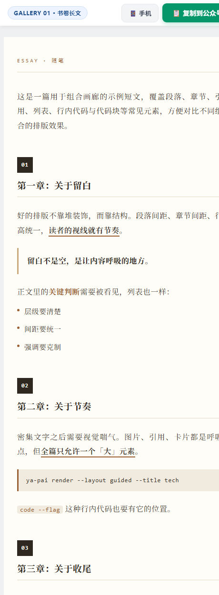 | 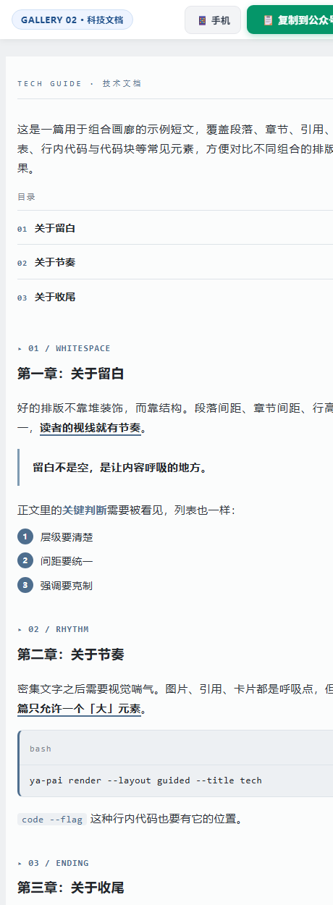 | 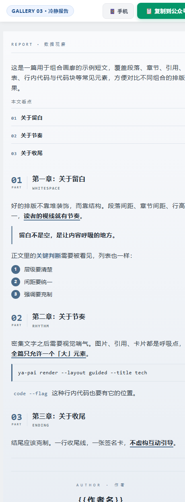 | 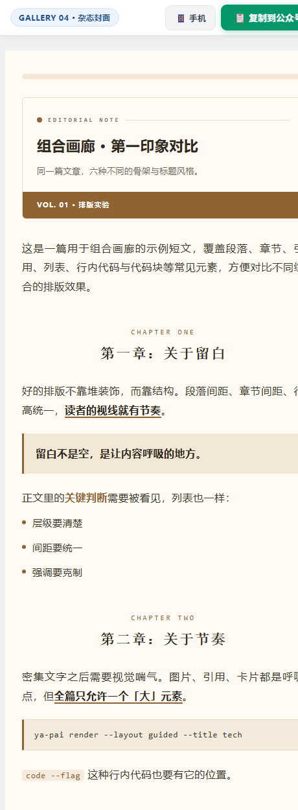 |

| g05 poster | g06 minimal | g07 lecture | g08 timeline |
|---|---|---|---|
| 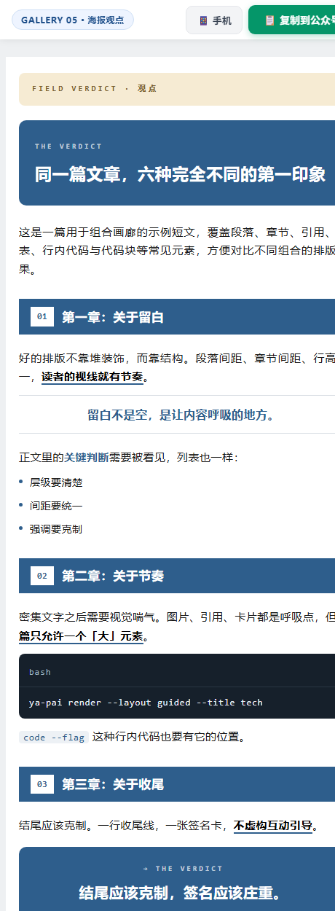 | 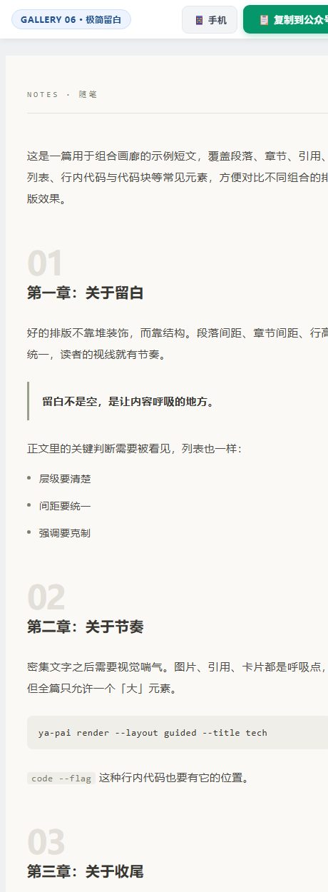 | 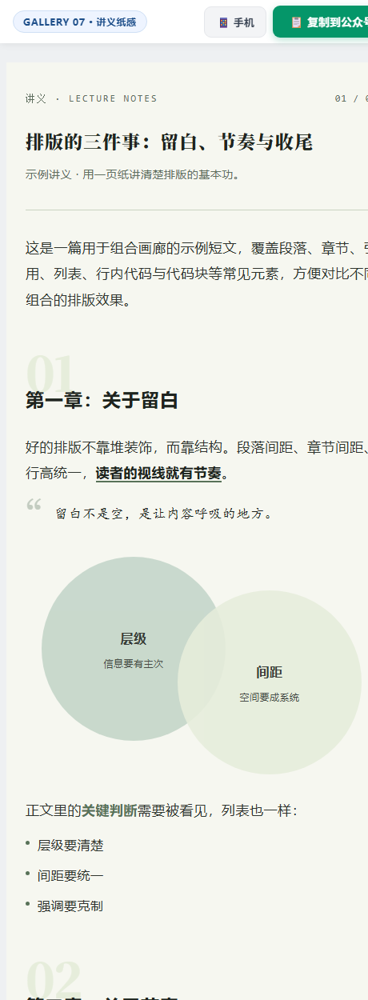 | 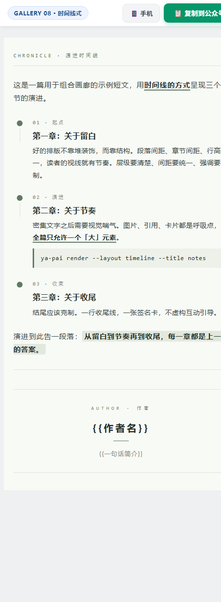 |

| g09 newspaper | g10 letter | g11 terminal |
|---|---|---|
| 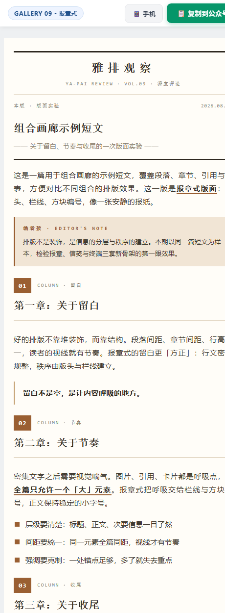 | 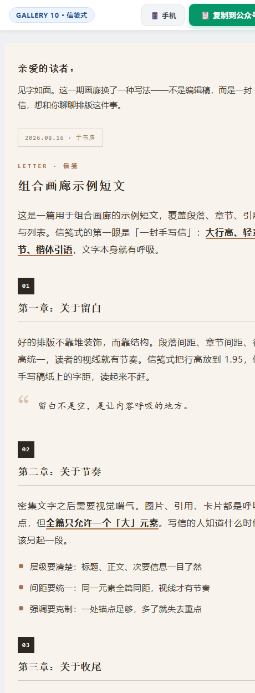 | 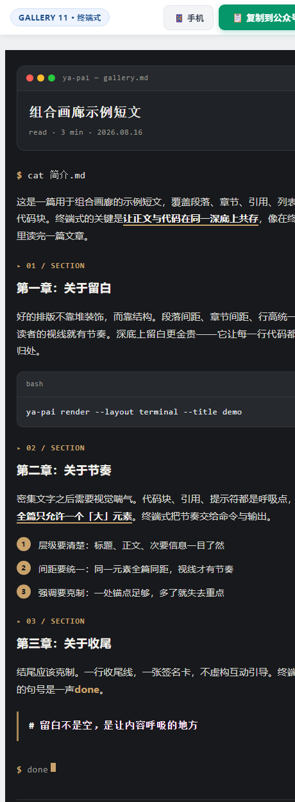 |

## 🎨 Diagram Family (F14a–F14z · 26 mini-diagrams)

> Abstract concepts — trade-offs, layering, loops, pipelines, metrics — drawn as tiny diagrams readers grasp at a glance. **All rendered with WeChat-compatible HTML/CSS** (flex / rounded corners / translucency / negative margins / gradients / borders; no SVG / absolute / grid), colors fully tokenized: they pick up your chosen palette automatically and need zero image assets.

**Usage rule**: diagrams are heavy components — **≤ 2 per article**, chosen by *content semantics*, not aesthetic: trade-off → seesaw/spectrum, layering → onion, loop → flywheel, data → bars, rating → stars. Full interactive overview (26 kinds + copyable templates) at [diagram-demo.html](examples/gallery/diagram-demo.html).


### ⚖️ Trade-offs & Comparisons

| F14a Seesaw | F14b Slider | F14c Spectrum |
|:---:|:---:|:---:|
| 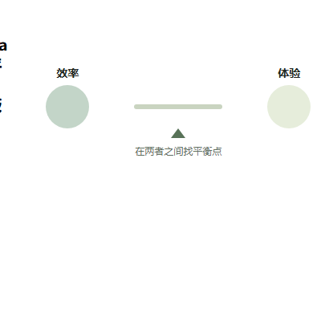 | 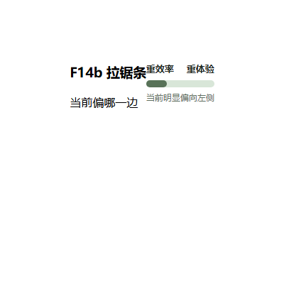 | 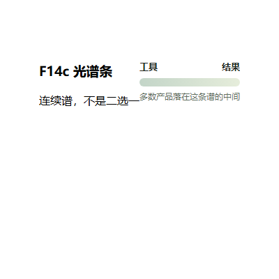 |
| trade-off / give-and-take | which side you lean to | a continuum, not binary |

| F14d Watershed | F14e Mirror vs | F14s Mirror bars |
|:---:|:---:|:---:|
| 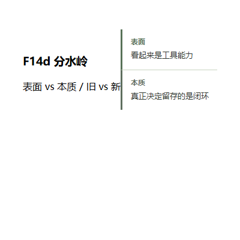 | 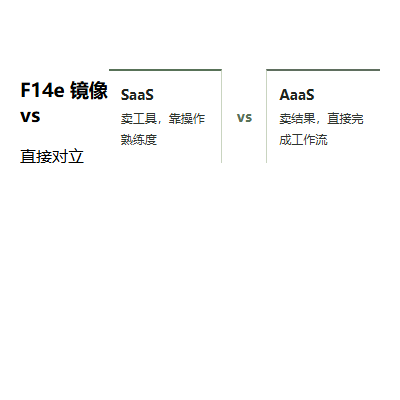 | 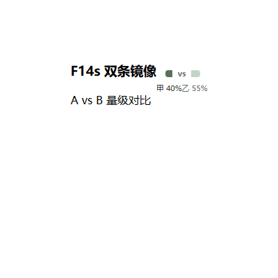 |
| surface vs essence / old vs new | direct opposition | A vs B magnitude |

### 🧅 Layering & Structure

| F14g Onion | F14h Stack cards | F14i Pyramid |
|:---:|:---:|:---:|
| 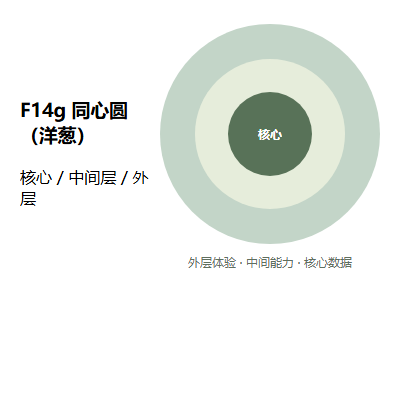 | 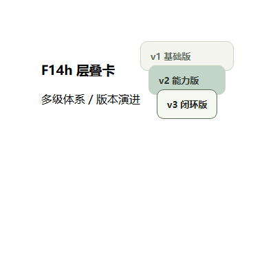 | 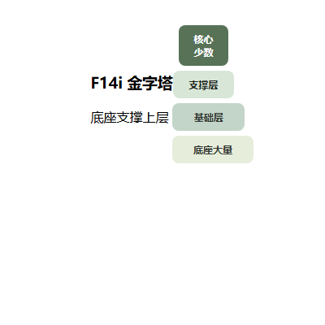 |
| core / middle / outer | multi-level system / versions | base supports the top |

| F14j Hub & spoke | F14k Containment | F14l Stack tower |
|:---:|:---:|:---:|
| 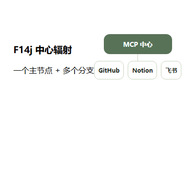 | 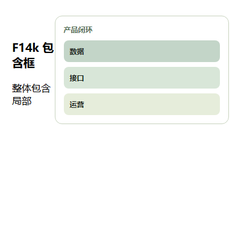 | 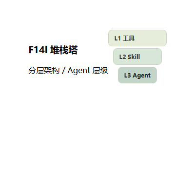 |
| one hub + many branches | whole contains parts | layered architecture / agent tiers |

### 🔻 Convergence & Filtering

| F14f Funnel |
|:---:|
| 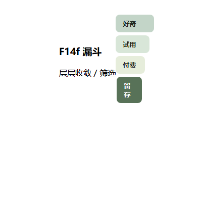 |
| layer-by-layer convergence / filtering |

### 🔄 Flows & Loops

| F14m Loop | F14n Pipeline | F14o Stairs |
|:---:|:---:|:---:|
| 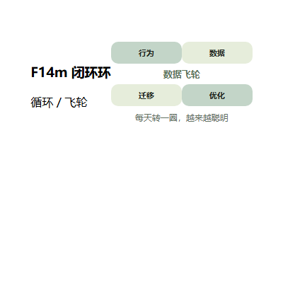 | 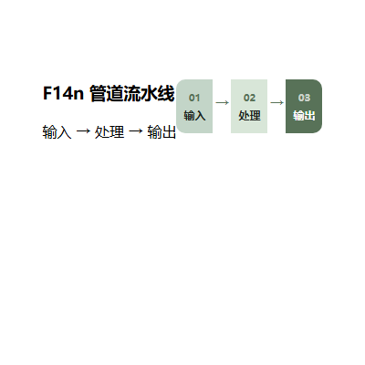 | 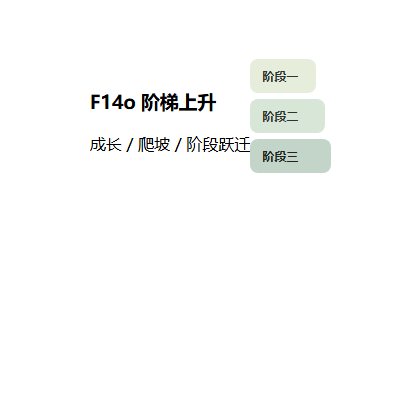 |
| cycle / flywheel | input → process → output | growth / climbing / leaps |

| F14p Feedback loop | F14q Milestones | F14w Role chain |
|:---:|:---:|:---:|
| 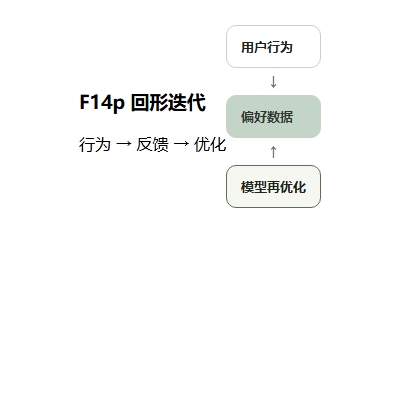 | 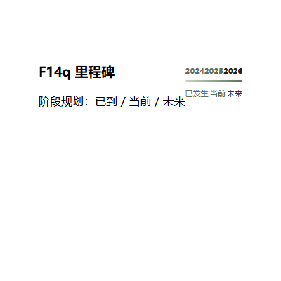 | 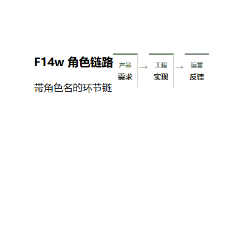 |
| action → feedback → optimize | done / now / next | chain with named roles |

| F14x Mapping | F14y State machine |
|:---:|:---:|
| 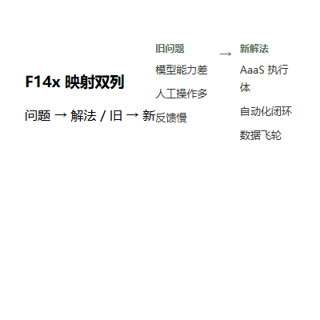 | 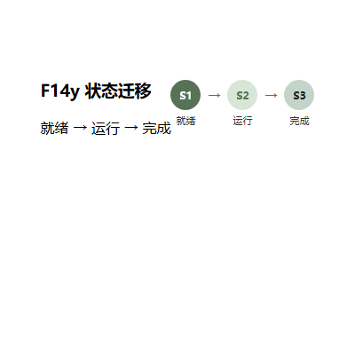 |
| problem → solution / old → new | ready → running → done |

### 📊 Metrics & Ratings

| F14r Growth bars | F14t Stars | F14u Heat ladder |
|:---:|:---:|:---:|
| 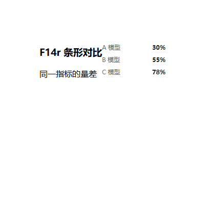 | 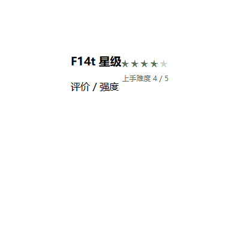 | 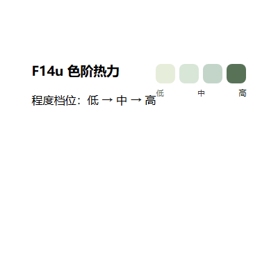 |
| magnitude of one metric | rating / intensity | level: low → mid → high |

| F14v Ratio split |
|:---:|
| 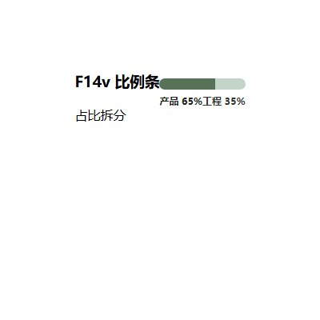 |
| share breakdown |

### 🏷️ Parallel & Weight

| F14z Tag cloud |
|:---:|
| 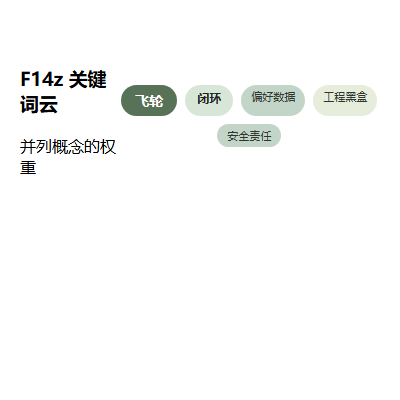 |
| parallel concepts & weight |

### 🧭 Diagram selection (by content semantics)

| Content semantics | Preferred diagrams |
|---|---|
| Trade-off / give-and-take / binary choice | F14a seesaw · F14b slider · F14c spectrum · F14e mirror-vs |
| Surface vs essence / old vs new | F14d watershed · F14e mirror-vs |
| Convergence / filtering | F14f funnel · F14i pyramid |
| Layering / nesting / architecture | F14g onion · F14h stack · F14l stack-tower · F14k containment |
| Hub + branches | F14j hub-spoke |
| Loop / flywheel / feedback | F14m loop · F14p feedback-loop |
| Pipeline / process / chain | F14n pipeline · F14w chain |
| Milestones / growth | F14q milestones · F14o stairs |
| Data magnitude / share | F14r growth-bars · F14s mirror-bars · F14v ratio-split |
| Rating / intensity | F14t stars · F14u heat-ladder |
| Mapping / state flow | F14x mapping · F14y state |
| Parallel concepts / keywords | F14z tag-cloud |

## 📁 Repository Layout

```
ya-pai/
├── SKILL.md                     # Skill definition + main workflow (agent entry)
├── README.md / README.en.md     # Docs (CN / EN)
├── LICENSE                      # MIT
├── agents/openai.yaml           # Agent UI metadata
├── references/                  # Rules the agent reads on demand
├── tokens/                      # Combinable design atoms + presets
├── templates/                   # HTML/CSS skeletons
├── examples/gallery/            # 11-piece gallery + diagram overview (26 kinds)
├── scripts/                     # validate / wrap-preview / publish-audit / shot-diagrams
└── assets/                      # Preview template + gallery & diagram screenshots
```

## 🛡️ Quality Gates

- **Validation**: `scripts/validate_gzh_html.py <output.html>` — flags everything the WeChat editor strips or breaks (`<style>`, `<div>`, `class/id`, `position`, `grid`, CSS variables, external fonts…), checks `<span leaf="">` wrapping, and runs WCAG contrast + aesthetic checks.
- **Preview**: `scripts/wrap_preview.py <body.html>` — wraps the body in a preview page with a "copy to WeChat" button.
- **Publish audit**: `scripts/publish_audit.py <body.html>` — placeholders, local images, size, missing preview.

## 📄 License

[MIT](LICENSE) © 2026 Walksu
